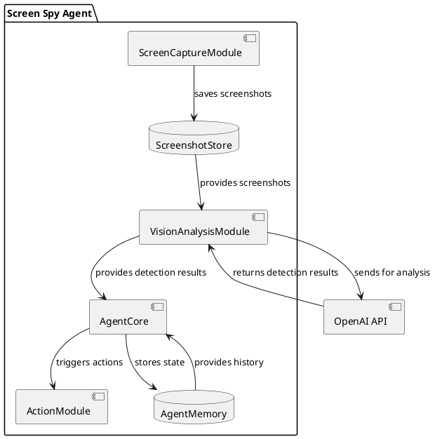
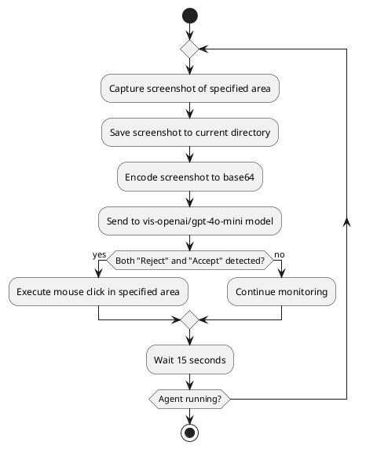

# Screen Spy Agent Implementation Plan

## Original Specification

твоя задача - сделать автономное агентское приложение на базе фреймворка langchain-langgraph;
приложение должно уметь следующее:
делать скриншот определённой области экрана с интервалом 1 раз в 15 секунд;
сохранять скриншот в текущей директории;
отправлять скриншот на распознавание модели vis-openai/gpt-4o-mini;
модель должна ответить, присутствуют ли на скриншоте слова Reject и Accept одновременно (да или нет)
если присутствуют, нужно эмулировать клик левой кнопкой мыши в определённой области экрана;
примеры кода агентского приложения можешь взять в файле ManipualtorAgentWithMemory001.py;
там же есть реальный ключ и базовый api url, которые тебе понадобятся;
в качестве основной модели для агента используй openai/gpt-4o-mini;
примеры кода манипулирующего скриншотами возьми в файле screen_spy_tkinter.py;
примеры кода реализации макроса клика мышки возьми в файле macrorecorder.py;
1. внимательно изучи настоящую спецификацию;
2. изучи упомянутые файлы с полезными примерами кода;
3. создай файл implementation_plan.md;
4. скопируй в этот файл эту исходную спецификацию;
5. напиши высокоуровневое описание архитектуры приложения и сохрани его в соответствующем разделе implementation_plan.md;
для иллюстрации используй диаграммы plantuml;
6. На базе всей имеющейся информации напиши детальную спецификацию реализации приложения, 
с детальным описанием и полным неймингом всех интерфейсов, классов и т.п.; используй plantuml диаграммы;
7. используй методологию TDD;
8. напиши подробный план реализации приложения, с возможностью отметки выполненных пунктов плана;
9. первая часть плана реализации - подробный план написания всех необходимых юнит-тестов;
10. вторая часть плана реализации - подробный план написания кода собственно приложения;
11. весь написанный код должен удовлетворять всем тестам;
12. приступай к последовательной реализации плана: бери самый верхний пункт, который не отмечен как выполненный, добивайся полного его выполнения, затем отметь его как выполненный;
13. повторяй циклически, пока все пункты плана не будут выполнены;

## High-Level Architecture

The application will be built as an autonomous agent system using the langchain-langgraph framework. The system will perform continuous monitoring of a specific area of the screen, analyze the content using a vision-language model, and take actions based on the detection results.

### Architecture Overview

### Component Responsibilities

1. **ScreenCaptureModule**: 
   - Captures screenshots of a specific screen area every 15 seconds
   - Saves screenshots to the current directory
   - Provides screenshots to the VisionAnalysisModule

2. **VisionAnalysisModule**:
   - Receives screenshots from the ScreenCaptureModule
   - Encodes screenshots to base64 format
   - Sends images to the vis-openai/gpt-4o-mini model via OpenAI API
   - Parses response to determine if "Reject" and "Accept" are both present

3. **ActionModule**:
   - Executes mouse clicks at specified coordinates when triggered
   - Handles proper mouse movement and click simulation

4. **AgentCore**:
   - Coordinates the workflow between modules
   - Maintains state using langchain-langgraph
   - Makes decisions based on analysis results
   - Stores and utilizes memory for making informed decisions

### Workflow Diagram

## Detailed Implementation Specification

### Class and Interface Definitions

```plantuml
@startuml
skinparam monochrome true

class ScreenShotTaker {
  - x1: int
  - y1: int
  - x2: int
  - y2: int
  - interval: int
  + __init__(x1: int, y1: int, x2: int, y2: int, interval: int)
  + capture_screenshot(): PIL.Image
  + save_screenshot(image: PIL.Image, path: str): str
  + get_screenshot_path(): str
}

class ImageAnalyzer {
  - api_key: str
  - api_base: str
  - model: str
  + __init__(api_key: str, api_base: str, model: str)
  + encode_image(image_path: str): str
  + analyze_image(image_path: str): dict
  + detect_text_in_image(image_path: str): bool
}

class MouseController {
  - target_x: int
  - target_y: int
  + __init__(target_x: int, target_y: int)
  + click_at_position(): bool
}

class AgentState {
  - detection_history: list
  - action_history: list
  - current_screenshot: str
  - both_words_detected: bool
  + __init__()
  + update_detection(detection_result: bool): None
  + update_action(action_taken: bool): None
  + set_current_screenshot(path: str): None
  + get_state(): dict
}

class AgentNode {
  + detect_words_in_screenshot(state: AgentState): AgentState
  + decide_action(state: AgentState): AgentState
  + execute_action(state: AgentState): AgentState
}

class ScreenSpyAgent {
  - screenshot_taker: ScreenShotTaker
  - image_analyzer: ImageAnalyzer
  - mouse_controller: MouseController
  - agent_state: AgentState
  - workflow: Graph
  + __init__(screenshot_params: dict, analyzer_params: dict, mouse_params: dict)
  + setup_workflow(): None
  + run_agent(): None
  + stop_agent(): None
}

ScreenShotTaker <-- ScreenSpyAgent
ImageAnalyzer <-- ScreenSpyAgent
MouseController <-- ScreenSpyAgent
AgentState <-- ScreenSpyAgent
AgentNode <-- ScreenSpyAgent

note right of ScreenShotTaker
  Handles screen capture
  and saving screenshots
end note

note right of ImageAnalyzer
  Handles image encoding
  and API interaction
end note

note right of MouseController
  Handles mouse simulation
  for clicking
end note

note right of AgentNode
  LangGraph nodes that
  define the agent workflow
end note

note right of AgentState
  Maintains the state
  of the agent workflow
end note

@enduml
```

### Key Components Details

1. **ScreenShotTaker**
   - Responsible for capturing screenshots of a defined area
   - Uses PIL.ImageGrab for screen capture
   - Saves screenshots with timestamps to current directory
   - Parameters include coordinates of the capture area and the interval

2. **ImageAnalyzer**
   - Encodes images to base64 format for API transmission
   - Sends encoded images to the vis-openai/gpt-4o-mini model
   - Parses the model's response to detect the presence of both "Reject" and "Accept"
   - Contains logic for handling API errors and retries

3. **MouseController**
   - Simulates mouse movement and clicks using PyAutoGUI
   - Targets a specific coordinate on screen
   - Provides feedback on whether the action was successful

4. **AgentState**
   - Maintains the state of the agent within the LangGraph workflow
   - Tracks detection history and action history
   - Stores the path to the current screenshot
   - Tracks whether both words were detected

5. **AgentNode**
   - Defines the individual nodes in the LangGraph workflow
   - Includes nodes for detection, decision-making, and action execution
   - Each node transforms the agent state in a specific way

6. **ScreenSpyAgent**
   - The main class that initializes and coordinates all components
   - Sets up and runs the LangGraph workflow
   - Handles the agent lifecycle (start, stop)

## Implementation Plan

### Phase 1: Unit Tests

- [x] **1.1. Test Environment Setup**
  - [x] 1.1.1. Set up pytest framework
  - [x] 1.1.2. Create test directory structure
  - [x] 1.1.3. Set up test fixtures and mocks

- [x] **1.2. ScreenShotTaker Tests**
  - [x] 1.2.1. Test screenshot capture functionality
  - [x] 1.2.2. Test screenshot saving functionality
  - [x] 1.2.3. Test coordinate validation
  - [x] 1.2.4. Test handling of invalid regions

- [x] **1.3. ImageAnalyzer Tests**
  - [x] 1.3.1. Test image encoding functionality
  - [x] 1.3.2. Test API request construction
  - [x] 1.3.3. Test response parsing
  - [x] 1.3.4. Test error handling and retries
  - [x] 1.3.5. Test text detection logic

- [x] **1.4. MouseController Tests**
  - [x] 1.4.1. Test mouse positioning
  - [x] 1.4.2. Test mouse click simulation
  - [x] 1.4.3. Test error handling for invalid coordinates

- [x] **1.5. AgentState Tests**
  - [x] 1.5.1. Test state initialization
  - [x] 1.5.2. Test state updates
  - [x] 1.5.3. Test history tracking
  - [x] 1.5.4. Test state retrieval

- [x] **1.6. AgentNode Tests**
  - [x] 1.6.1. Test detection node
  - [x] 1.6.2. Test decision node
  - [x] 1.6.3. Test action node
  - [x] 1.6.4. Test node transitions

- [x] **1.7. ScreenSpyAgent Tests**
  - [x] 1.7.1. Test agent initialization
  - [x] 1.7.2. Test workflow setup
  - [x] 1.7.3. Test agent execution
  - [x] 1.7.4. Test agent stopping
  - [x] 1.7.5. Test end-to-end functionality with mocks

### Phase 2: Application Implementation

- [x] **2.1. Core Components**
  - [x] 2.1.1. Implement ScreenShotTaker class
  - [x] 2.1.2. Implement ImageAnalyzer class
  - [x] 2.1.3. Implement MouseController class
  - [x] 2.1.4. Implement AgentState class

- [x] **2.2. Agent Framework**
  - [x] 2.2.1. Set up langchain-langgraph environment
  - [x] 2.2.2. Implement AgentNode class with all node functions
  - [x] 2.2.3. Implement the agent workflow graph

- [x] **2.3. Main Agent Implementation**
  - [x] 2.3.1. Implement ScreenSpyAgent class
  - [x] 2.3.2. Implement configuration loading
  - [x] 2.3.3. Implement agent lifecycle management

- [x] **2.4. Integration**
  - [x] 2.4.1. Integrate all components
  - [x] 2.4.2. Implement proper error handling and logging
  - [x] 2.4.3. Add configuration options

- [x] **2.5. Documentation**
  - [x] 2.5.1. Add inline code documentation
  - [x] 2.5.2. Create usage documentation
  - [x] 2.5.3. Document configuration options

## Next Steps

All tasks have been completed! The Screen Spy Agent is now ready for use. 