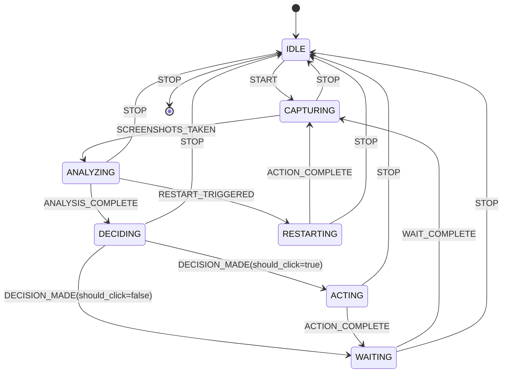

# Screen Spy Agent State Machine

## Overview

The ScreenSpyAgent application can be restructured as a Finite State Machine (FSM) to enhance clarity, maintainability, and testability. This document outlines a proposed state machine structure.

## States

1. **IDLE** - Initial state when the agent is not running
2. **CAPTURING** - Taking screenshots of target screen areas
3. **ANALYZING** - Analyzing screenshots for text detection
4. **DECIDING** - Determining whether to take action based on analysis
5. **ACTING** - Executing mouse actions (clicks)
6. **RESTARTING** - Executing start sequence for a new cycle
7. **WAITING** - Pausing between iterations

## Events

1. **START** - Agent is started
2. **STOP** - Agent is stopped
3. **SCREENSHOTS_TAKEN** - Screenshots have been captured
4. **ANALYSIS_COMPLETE** - Text detection analysis is complete
5. **DECISION_MADE** - Decision on whether to take action is made
6. **ACTION_COMPLETE** - Mouse action has been completed
7. **RESTART_TRIGGERED** - Condition for restart cycle detected
8. **WAIT_COMPLETE** - Wait interval has elapsed

## State Transition Diagram



## State Transition Table

| Current State | Event               | Next State  | Action                                          | Condition                                  |
|---------------|---------------------|-------------|------------------------------------------------|--------------------------------------------|
| IDLE          | START               | CAPTURING   | Initialize components                           | -                                          |
| CAPTURING     | SCREENSHOTS_TAKEN   | ANALYZING   | Store screenshot paths                          | -                                          |
| ANALYZING     | ANALYSIS_COMPLETE   | DECIDING    | Update detection history                        | No restart conditions met                  |
| ANALYZING     | RESTART_TRIGGERED   | RESTARTING  | -                                               | "new chat" detected OR Area 2 inactive     |
| DECIDING      | DECISION_MADE       | ACTING      | -                                               | should_click = true                        |
| DECIDING      | DECISION_MADE       | WAITING     | -                                               | should_click = false                       |
| ACTING        | ACTION_COMPLETE     | WAITING     | Update action history                           | -                                          |
| RESTARTING    | ACTION_COMPLETE     | CAPTURING   | Reset last activity time                        | -                                          |
| WAITING       | WAIT_COMPLETE       | CAPTURING   | -                                               | interval elapsed                           |
| Any State     | STOP                | IDLE        | Clean up resources                              | -                                          |

## Implementation Approach

### State Interface
```python
class State:
    def enter(self, context):
        """Called when entering the state"""
        pass
        
    def exit(self, context):
        """Called when exiting the state"""
        pass
        
    def handle_event(self, context, event, **kwargs):
        """Process an event and return the next state or None"""
        pass
```

### State Machine Context
```python
class ScreenSpyStateMachine:
    def __init__(self, agent):
        self.agent = agent
        self.current_state = IdleState()
        self.current_state.enter(self)
        
    def transition_to(self, new_state):
        self.current_state.exit(self)
        self.current_state = new_state
        self.current_state.enter(self)
        
    def process_event(self, event, **kwargs):
        next_state = self.current_state.handle_event(self, event, **kwargs)
        if next_state:
            self.transition_to(next_state)
```

## Benefits of State Machine Pattern

1. **Explicit State Handling**: Clear separation of behavior based on the current state
2. **Simplified Logic**: Complex conditional logic replaced with state-specific behavior
3. **Improved Testability**: Each state can be tested in isolation
4. **Enhanced Maintainability**: Easy to add new states or modify transitions
5. **Better Debugging**: Current state is always explicit and traceable

## Integration Strategy

To integrate this state machine with the existing ScreenSpyAgent:

1. Replace the agent loop with the state machine
2. Convert the workflow decision points to state transitions
3. Use the existing agent state for data storage
4. Move the screenshot taking, analysis, and action code into the appropriate state classes
5. Keep the cyclic prompt management separate from the state machine

This approach would maintain all the existing functionality while providing a more structured flow. 